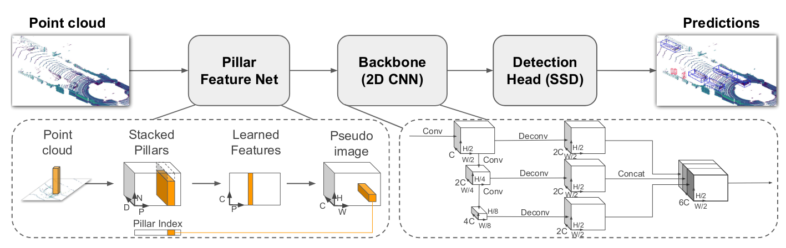

# zero2pointpillars

## 讲解

[3D点云 (Lidar)检测入门篇--PointPillars PyTorch实现](https://zhuanlan.zhihu.com/p/521277176)

## 开发笔记

### 2023.12.03

[史上最全！Pytorch中归一化层的介绍使用(Batch Normalization、Layer Normalization、Instance Normalization、GroupNorm)](https://zhuanlan.zhihu.com/p/470260895?utm_id=0)

[[网络层]什么是BatchNormal](https://www.jianshu.com/p/913e4c08a638)

[torch.meshgrid()函数解析](https://blog.csdn.net/weixin_39504171/article/details/106356977)

[一文带你搞懂Python中pickle模块](https://zhuanlan.zhihu.com/p/419362785)

[Pytorch技巧:DataLoader的collate_fn参数使用详解](https://zhuanlan.zhihu.com/p/361830892)

[torch.optim.lr_scheduler.OneCycleLR学习与理解](https://blog.csdn.net/jiongta9473/article/details/131246851)

### 2023.12.01

[终于搞懂了 super(XXXX, self).__init__()的作用是啥了](https://blog.csdn.net/weixin_44025103/article/details/126143715)

[pytroch中ctx和self的区别](https://blog.csdn.net/littlehaes/article/details/103828130)

[torch.cat()函数的官方解释，详解以及例子](https://blog.csdn.net/xinjieyuan/article/details/105208352)

